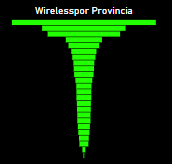

# Henry_telecomunicaciones
### Proyecto de Análisis de Datos de Telecomunicaciones

Este repositorio contiene un proyecto de análisis de datos relacionados con telecomunicaciones. Se han utilizado datos obtenidos de la API de ENACOM para llevar a cabo un análisis exploratorio (EDA) y crear visualizaciones a través de Power BI.

## Estructura del Repositorio

- **data:** Carpeta que contiene archivos CSV generados a partir de los datos de telecomunicaciones. Estos archivos se utilizan como fuente de datos para el dashboard creado en Power BI.
- **EDA:** En esta carpeta se encuentran los Jupyter Notebooks utilizados para realizar el Análisis Exploratorio de Datos (EDA). Estos notebooks contienen el procesamiento de los dataframes obtenidos directamente de la API de ENACOM.
- **Power BI Dashboard:** Archivo de Power BI que presenta visualizaciones y análisis detallado de los datos recopilados.

## Conclusiones del Proyecto

Después de realizar el Análisis Exploratorio de Datos y visualizar la información mediante Power BI, se han identificado varias conclusiones importantes:

- **Tecnologia Wireless:** Se observaron patrones de crecimiento productivo en la tecnologia wireless, suponiendo una inversion segura en esta misma. Al invertir en tecnología wireless, se podría ofrecer a los residentes y las empresas una alternativa a las opciones existentes de acceso a Internet. Diversificar la oferta de servicios podría atraer a clientes que buscan opciones de calidad y precios competitivos.

- **Distribución geográfica de uso:** Se identificaron áreas geográficas con mayor demanda de servicios de telecomunicaciones, lo que podría ser relevante para estrategias de cobertura y servicios. Para la zona de Mendoza, Santa Fe y Entre Rios.

- **Competencia Relativamente Baja:** Si bien Buenos Aires es una provincia con una fuerte competencia en todas las categorías de tecnología, Mendoza, Santa Fe y Entre rios podrían ofrecer un entorno menos competitivo para entrar en el mercado de la tecnología wireless. Esto podría permitir establecer una posición sólida antes de que la competencia aumente.

- **Diversificación de Oferta:** Al invertir en tecnología wireless en las provincias mencionadas, podría ofrecer a los residentes y las empresas una alternativa a las opciones existentes de acceso a Internet. Diversificar la oferta de servicios podría atraer a clientes que buscan opciones de calidad y precios competitivos.

Estas conclusiones son un resumen de los hallazgos clave obtenidos a través del análisis de datos.

## Key Performance Indicators (KPIs)

### Crecimiento de la Tecnología Wireless a Nivel Trimestral por Provincias

Se ha realizado un KPI que analiza el crecimiento de la tecnología wireless a nivel trimestral, agrupando los datos por provincias. Este indicador proporciona información clave sobre la expansión y adopción de tecnologías inalámbricas en diferentes regiones del país. Los resultados detallados de este KPI se han obtenido a través del análisis de los datos proporcionados por la API de ENACOM.

### Aumento de Accesos a Internet en Hogares a Nivel Trimestral por Provincias

Otro KPI analizado se centra en el aumento de accesos a internet en hogares a nivel trimestral, también agrupado por provincias. Este indicador ofrece una visión detallada sobre cómo el acceso a internet en los hogares ha evolucionado a lo largo del tiempo en diferentes áreas geográficas. Los datos utilizados para este análisis se han extraído y procesado a partir de la información suministrada por la API de ENACOM.

Estos KPIs proporcionan información valiosa sobre la adopción y crecimiento de tecnologías inalámbricas, así como sobre la expansión de la conectividad a internet en los hogares a lo largo del tiempo y en distintas regiones del país.

## Instrucciones de Uso

Para explorar los datos o visualizar el dashboard en Power BI:

1. Accede a la carpeta `data` para revisar los archivos CSV generados.
2. Explora la carpeta `EDA` para acceder a los Jupyter Notebooks utilizados en el Análisis Exploratorio de Datos.
3. Abre el archivo de Power BI ubicado en la carpeta del dashboard para visualizar las representaciones visuales de los datos.

